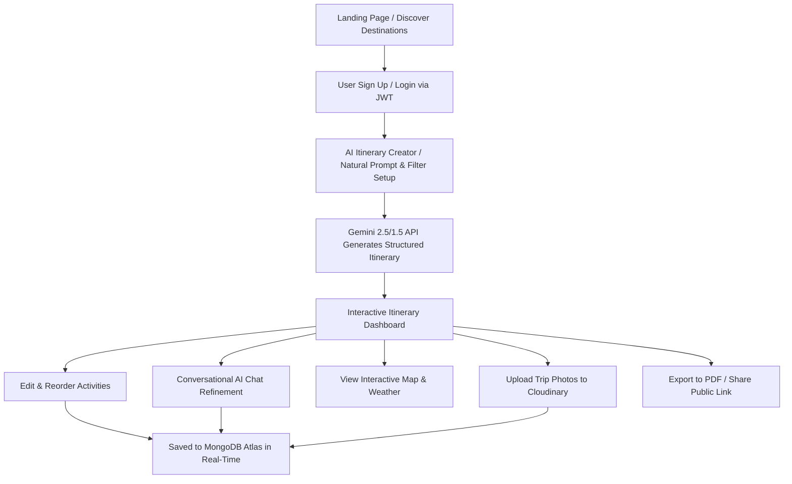

# Product Requirements Document (PRD) - WanderSync
**Project Name:** WanderSync  
**Theme:** AI Powered Itinerary Maestro  
**Category:** Generative AI Odyssey (TechWiz 6 / Aptech SRS v1.0 Aligned)  
**Document Version:** 1.0.0  
**Target Stack:** MERN (MongoDB Atlas, Express.js, React 19, Node.js) + Google Gemini API + Cloudinary  

---

## 1. Executive Summary & Product Vision

### 1.1 Executive Summary
**WanderSync** is an intelligent, full-stack AI travel companion and itinerary planner built to revolutionize how travelers discover, design, and manage their trips. Leveraging Google's latest **Gemini Generative AI model**, WanderSync turns natural language travel prompts (e.g., *"7-day cultural immersion in Kyoto with matcha cafes and historic temples on a $120/day budget"*) into day-wise, optimized, interactive itineraries complete with activity timelines, geo-coordinates, cost estimates, and real-time weather forecasts.

### 1.2 Product Vision
To eliminate travel planning friction and decision fatigue by offering a hyper-personalized, context-aware, and real-time collaborative platform that delivers bespoke itineraries within 3-5 seconds—backed by modern aesthetics, zero dummy data, and 100% free-tier cloud infrastructure.

---

## 2. Problem Statement & Target Audience

### 2.1 The Problem
- **Information Overload & Static Templates:** Modern travel planning requires browsing dozens of blogs, review sites, and booking engines. Static travel templates fail to adapt to personal preferences, budget constraints, travel pace, and weather conditions.
- **Disconnected Tools:** Travelers currently juggle separate apps for notes, spreadsheets for budgeting, maps for routing, and chat apps for group planning.
- **Slow & Generic AI Outputs:** Generic AI tools produce unformatted text without interactive editing, map routing, visual media, or export capabilities.

### 2.2 Target Audience & User Personas

| Persona | Description | Primary Needs | Key Pain Points |
| :--- | :--- | :--- | :--- |
| **Solo Explorer (Alex, 24)** | Backpacker & cultural enthusiast | Fast, budget-friendly itineraries with local hidden gems and public transit tips | Overpriced tourist traps, rigid schedules |
| **Family Organizer (Sarah, 38)** | Traveling with spouse and 2 kids | Balanced pace, child-friendly attractions, realistic driving/walking times, clear daily budget | Meltdowns due to packed schedules, lack of flexible rescheduling |
| **Weekend Getaway Seeker (Zain, 29)** | Busy corporate professional | Instant 2-3 day weekend plans with top-rated dining and scenic spots | No time to spend 5 hours researching a 48-hour trip |
| **Group Travel Coordinator (Maria, 31)** | Planning trips with friends | Collaborative itinerary sharing, split budgeting, and downloadable PDF plans | Confusion over group preferences, lost WhatsApp notes |

---

## 3. Core Value Propositions & Key Differentiators

1. **Natural Language to Full-Fledged Itinerary:** High-speed itinerary generation powered by Gemini API with structured JSON output, day-by-day breakdowns, morning/afternoon/evening time slots, and smart travel tips.
2. **Interactive Visual Customization:** Drag, re-order, add, remove, and modify activities dynamically with instant recalculation of daily budgets and times.
3. **Rich Cloud Media Integration:** Seamless trip cover and user avatar uploads to **Cloudinary**, serving fast CDN-optimized images with metadata saved in **MongoDB Atlas**.
4. **Interactive Maps & Real-time Weather:** Free OpenStreetMap / Leaflet geocoding and Open-Meteo real-time weather forecasts integrated into each itinerary day.
5. **Interactive Conversational AI Assistant:** Integrated chat assistant that allows users to refine plans on the fly (e.g., *"Make Day 3 more relaxed and add an Italian bistro"*).
6. **Zero Dummy Data & Free-Tier Native:** Built entirely on production-grade free-tier services (Google Gemini API, MongoDB Atlas M0, Cloudinary Free, Open-Meteo, Leaflet) without licensing costs.

---

## 4. User Journey & Experience Flow

---

## 5. Detailed Feature Specifications & Epics

### Epic 1: Authentication & User Profile Management
- **User Registration & Login:** Email/password authentication with bcrypt password hashing and JWT token issuance.
- **Profile Customization:** User profile screen with preferences (travel style, dietary requirements, default currency, preferred travel pace).
- **Cloudinary Avatar Upload:** Users can upload custom avatar pictures directly to Cloudinary with secure URLs stored in their MongoDB profile.
- **Protected Sessions & Token Refresh:** Seamless session handling with local storage / cookie integration and auto-logout on token expiration.

### Epic 2: AI-Powered Itinerary Maestro (Gemini Core Engine)
- **Natural Language Prompt Input:** Smart prompt input box with quick tags (e.g., *"Solo Backpacker"*, *"Romantic Luxury"*, *"Family Adventure"*, *"Budget $80/day"*).
- **Structured AI Generation:** Backend prompts Gemini to output strict JSON schemas containing:
  - Destination name, country, summary, tagline, best season.
  - Estimated total budget breakdown (Accommodation, Food, Activities, Transit).
  - Day-by-day plans with time slots (Morning, Afternoon, Evening), activity descriptions, geo-coordinates, estimated durations, and estimated costs.
  - Essential local tips (culture, transit, safety, packing checklist).
- **Fallbacks & Error Resilience:** Intelligent JSON parsers and rate-limit retry handlers to ensure smooth user experience even on high traffic.

### Epic 3: Interactive Conversational AI Assistant
- **Trip Context Chatbot:** In-itinerary chat drawer that maintains conversation history and current itinerary context.
- **Natural Language Modifications:** Users can ask the assistant to swap activities, adjust budgets, change pacing, or ask destination-specific questions.
- **Real-Time Update Actions:** Chat responses can trigger direct updates to the MongoDB itinerary state.

### Epic 4: Itinerary Management & Interactive Destination Maps
- **Itinerary Hub:** Dashboard displaying user's upcoming, past, and drafted trips with search, filter, and sorting.
- **Day & Activity Editor:** Add custom activities, edit timings, delete stops, or mark activities as completed.
- **Interactive Map View:** Leaflet/OpenStreetMap markers showing all daily stops with connecting route lines, popup cards, and direction helpers.
- **Cloudinary Trip Gallery:** Users can upload memories and cover photos for each trip stored in Cloudinary.

### Epic 5: Smart Budgeting & Expense Tracking
- **Budget vs. Actual Tracker:** Visual breakdown comparing estimated Gemini AI costs with real expenses logged by the user.
- **Category Breakdown:** Interactive charts showing spend across Stay, Food, Transport, Tickets, and Shopping.

### Epic 6: Real-Time Weather & Local Insights
- **Live Weather Integration:** Integration with Open-Meteo API for real-time 7-day temperature, precipitation, and weather condition badges for the destination.
- **Local Alerts & Packing Advisory:** AI-generated packing lists and seasonal travel advisories based on target travel dates.

### Epic 7: Exporting & Social Sharing
- **High-Quality PDF Export:** One-click clean PDF generation with formatted day plans, emergency contacts, and maps for offline travel.
- **Public Shareable Links:** Toggle public/private visibility to share read-only itinerary links with travel companions.
- **Direct Copy / Print View:** Formatted, print-friendly layout.

---

## 6. Non-Functional & Quality Requirements

- **Response Time:** AI itinerary generation must complete within 3–5 seconds under standard network conditions.
- **Security:** Strict CORS, Helmet headers, JWT auth verification on protected endpoints, input validation, and zero leaked keys.
- **Design Excellence:** Adherence to `docs/skills/frontend-design` and `docs/skills/responsive-design`: custom typography, liquid glass effects, dark/light harmonious color palette, 44px+ mobile touch targets, and fluid layouts.
- **No Native Alerts:** All user notifications, confirmations, and warnings must use modern custom animated modal dialogs.
- **File Limit Compliance:** All backend files strictly capped at <=120 lines; frontend split into focused, single-responsibility components.

---

## 7. Success Metrics & KPIs

| Metric | Target Goal | Measurement Method |
| :--- | :--- | :--- |
| **Itinerary Generation Speed** | < 4.0s average | Server response latency logging |
| **Generation Success Rate** | > 99.0% | Error rate monitoring in Gemini API wrapper |
| **User Customization Rate** | > 60% of users edit generated trips | MongoDB activity modification tracking |
| **PDF Export / Share Rate** | > 35% of completed itineraries | Event analytics on share/export clicks |
| **Mobile Responsiveness Score** | 100% responsive across 320px–4k | Chrome DevTools responsive tests |

---

## 8. Release Roadmap

- **Phase 1 (MVP Foundation):**
  - MERN backend architecture + MongoDB Atlas models.
  - JWT Authentication + Cloudinary Profile & Trip Image Uploads.
  - Gemini API AI Itinerary Engine + Interactive Itinerary View.
  - Leaflet Map + Open-Meteo Weather integration.
  - Custom Modal Dialog System + Responsive Glass UI.
- **Phase 2 (Collaboration & Assistant Enhancement):**
  - Multi-turn conversational AI trip editor.
  - PDF Export generator & shareable public itinerary URLs.
  - Budget & Expense logging dashboard.
- **Phase 3 (Mobile & Voice Additions):**
  - Web Speech API voice input for conversational prompts.
  - Progressive Web App (PWA) offline itinerary caching.
