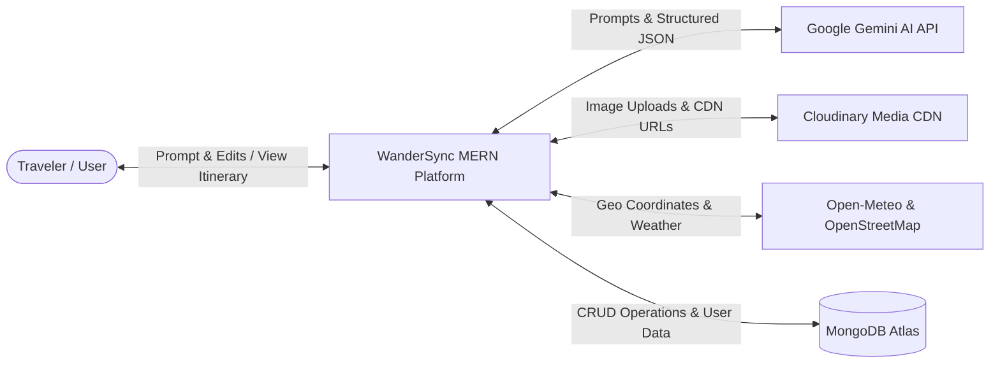
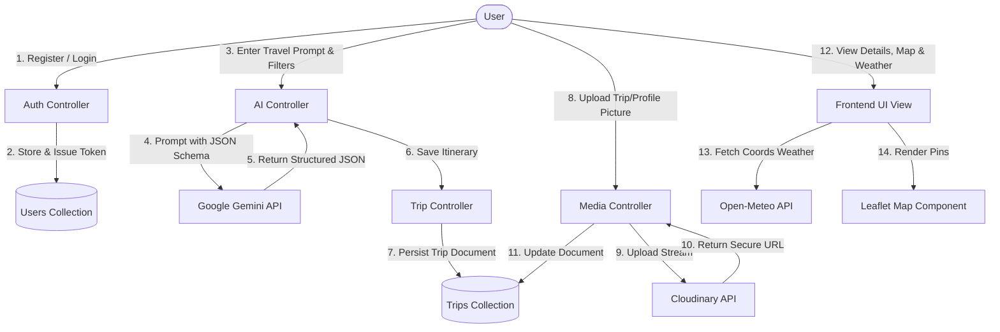

# Software Requirements Specification (SRS / SRD)
**Project Name:** WanderSync  
**Document Version:** 1.0.0  
**Theme:** AI Powered Itinerary Maestro  
**Category:** Generative AI Odyssey (TechWiz 6 / Aptech SRS v1.0 Aligned)  
**Authors / Developers:** WanderSync Engineering Team  
**Architecture:** MERN Stack + Google Gemini Generative AI + Cloudinary Media Engine  

---

## 1. Introduction & Background

### 1.1 Background and Necessity for the Application
In an increasingly connected world, travel has become accessible to millions, yet planning a personalized, efficient, and fulfilling itinerary remains a time-consuming and overwhelming task. Traditional travel planning tools rely heavily on manual input and static templates. They often offer generic suggestions that fail to align with an individual’s unique preferences, budget constraints, travel pace, and real-time variables such as weather, seasonality, and local events.

With advancements in Generative AI, Large Language Models (LLMs), and Google Gemini APIs, there is a powerful opportunity to transform static plans into intelligent, interactive travel companions. **WanderSync** addresses this gap by offering travelers a dynamic, conversational interface that not only understands their preferences, but also curates, optimizes, and customizes multi-day travel plans across global destinations. Whether for solo backpackers, family tourists, or luxury seekers, users can interact naturally, receiving context-aware suggestions that evolve in real time.

### 1.2 Proposed Solution
WanderSync simplifies and personalizes the travel planning experience using an AI-driven engine powered by the latest **Google Gemini API** (free-tier tier compatible). 

The platform architecture spans multiple functional layers:
1. **User Interaction Layer:** A responsive web interface with liquid glass aesthetics, quick prompt templates, and custom theme-aware modals (no native alerts).
2. **AI Integration Layer:** Express.js controller connecting to Google Gemini Generative AI via official SDK, executing structured system prompts to return verified JSON day-by-day travel schedules.
3. **Media Management Layer:** Seamless image uploads for user profiles and trip cover photos powered by **Cloudinary**, with CDN URLs stored in **MongoDB Atlas**.
4. **Data Aggregation & Mapping Layer:** Free integration with OpenStreetMap / Leaflet for geo-visualizations and Open-Meteo for real-time 7-day weather forecasts.
5. **Optimization & Expense Engine:** Logic-based itinerary optimization considering time, budget, and travel distance, paired with an interactive expense logging module.
6. **Output Formatting Layer:** Interactive timelines, printable views, high-fidelity PDF export, and shareable public links.

### 1.3 Purpose of the Document
This document presents a detailed, formal description of the Generative AI-powered travel planning application titled **WanderSync**. It defines both functional and non-functional requirements, interface specifications, constraints, and project deliverables for developers, evaluators, and stakeholders.

### 1.4 Scope of Project
The scope involves developing a full-stack MERN web application where users can:
- Authenticate securely via JWT and manage their profile with Cloudinary avatar uploads.
- Submit natural language travel prompts and preference filters.
- Generate structured day-wise travel itineraries with estimated budgets, activities, and local tips using Gemini AI.
- Modify and reorder activities dynamically.
- View interactive maps with plotted activity pins and check real-time weather forecasts.
- Track real trip expenses against AI budget estimates.
- Export itineraries to PDF documents or share public URLs.

---

## 2. Constraints

1. **External API Free-Tier Quotas:** Third-party APIs (Google Gemini, Cloudinary, Open-Meteo) must be utilized within generous free-tier limits without requiring paid credit cards.
2. **Network Latency & AI Rate Limits:** AI generation and real-time data retrieval must implement fallback parsing and retry mechanisms to prevent application timeouts.
3. **Data Security & Privacy:** User credentials must be cryptographically hashed using bcryptjs. JWT tokens must be verified on all protected API routes.
4. **Project Rules Compliance (`docs/rules.md`):**
   - Server backend files must strictly remain **<= 120 lines per file**.
   - Frontend must be split into modular, reusable components without bloated 1200+ line files.
   - Code must contain **zero comments** in generated source files.
   - Zero dummy data or placeholder mocks; all features must be fully functional.
   - No native browser `alert()` or `confirm()` dialogs; all prompts must use custom UI modals.

---

## 3. Functional Requirements (FR)

| Requirement ID | Module / Feature | Specification Details |
| :--- | :--- | :--- |
| **FR-1** | **User Input Handling** | Accept travel inputs via web interface (destination, start/end dates, budget level, companion type, interests, pace) in both form and natural prompt format. |
| **FR-2** | **Conversational Interface** | Support chat-style interactive drawer where users can ask questions, refine specific days, or request alternative activities in real-time. |
| **FR-3** | **Gemini AI Itinerary Generation** | Process user prompts using Google Gemini model (`gemini-1.5-flash` / `gemini-2.5-flash`) to generate structured JSON day plans, time slots (Morning, Afternoon, Evening), locations, and costs. |
| **FR-4** | **Cloudinary Media Uploads** | Allow users to upload profile pictures and custom trip cover photos via Cloudinary, storing CDN paths in MongoDB Atlas. |
| **FR-5** | **Optimization & Expense Logic** | Calculate daily budget totals, compare estimated vs. actual expenses, and provide visual category spend breakdowns. |
| **FR-6** | **Personalization & History** | Store user trip history, preferences, and saved itineraries in MongoDB Atlas for quick access and multi-trip management. |
| **FR-7** | **Interactive Maps & Weather** | Embed Leaflet map with geo-coordinates for itinerary activities; fetch real-time 7-day weather forecasts via Open-Meteo. |
| **FR-8** | **Itinerary Output & PDF Export** | Format final itineraries into a print-friendly view and generate downloadable PDF files using jsPDF. |
| **FR-9** | **Public Link Sharing** | Generate unique sharing slugs for itineraries allowing public, read-only viewing by travel companions without requiring login. |
| **FR-10** | **Custom Modal Dialog System** | Provide custom animated modals for confirmations (e.g., delete trip, remove activity) and notifications instead of native alerts. |

---

## 4. Non-Functional Requirements (NFR)

1. **Performance:** The system should generate and display personalized itineraries within **3 to 5 seconds** under normal load.
2. **Security:** All user data (passwords, tokens, itinerary history) must be securely transmitted and stored using industry standards (HTTPS, bcryptjs, JWT).
3. **Scalability:** Modular MERN architecture handles concurrent requests and separates static asset delivery to Cloudinary CDN.
4. **Reliability:** Gemini JSON responses are validated against a strict schema with automatic sanitization to prevent malformed data errors.
5. **Usability & Aesthetics:** Modern liquid-glass aesthetics, fluid responsive layouts across all screen sizes (mobile, tablet, desktop), and smooth micro-animations.

---

## 5. Interface Requirements

### 5.1 Hardware Requirements
- **Development/Client Machine:** Intel Core i5/i7 Processor or Apple Silicon, 8 GB RAM or higher, SVGA display, Keyboard & Mouse.
- **Server/Host:** Compatible with modern cloud hosts (Render, Vercel, Railway, Node.js runtime).

### 5.2 Software Requirements
- **Operating Systems:** Windows 10/11, macOS, Linux.
- **Frontend Stack:** HTML5, CSS3, JavaScript (ES6+), React 19, Vite, Tailwind CSS v4, Lucide React.
- **Backend Stack:** Node.js (v20+), Express.js (Modular MVC, <=120 lines/file), Mongoose.
- **Database:** MongoDB Atlas Cloud (Free M0 Cluster).
- **APIs & Services:** Google Gemini API (`@google/genai` or `@google/generative-ai`), Cloudinary SDK, Open-Meteo REST API, Leaflet OpenStreetMap.
- **Tools & Package Managers:** npm / npx, Git, VS Code / Antigravity IDE, Postman.

---

## 6. System Architecture & Data Flow

### 6.1 Level-0 Context Diagram

### 6.2 Level-1 Data Flow Diagram

---

## 7. Deliverables Checklist (TechWiz 6 Specification)

- [x] **Problem Definition & Solutions:** Fully elaborated in PRD, TRD, and SRD.
- [x] **Design Specifications:** Modern UI, Liquid Glass, Tailwind v4, custom modals, responsive layout.
- [x] **User Flow Diagrams & Architectural Maps:** Illustrated via Mermaid diagrams.
- [x] **Execution & Installation Instructions:** Provided in project root and TRD.
- [x] **Test Data & Validation:** Real-world travel test scenarios (Paris 5-day cultural, Tokyo 7-day budget, Rome 3-day weekend).
- [x] **Source Code Structure:** Clean MERN stack adhering to 120-line file limits, no comments, latest versions.
- [x] **Blog & Video Demonstration Strategy:** Plan for 2000+ word technical blog and .mp4 walkthrough video showcasing all functional requirements.
