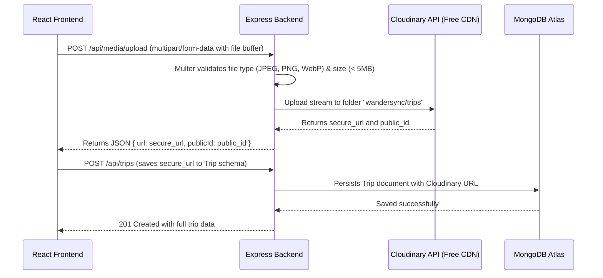

# Technical Requirements Document (TRD) - WanderSync
**Project Name:** WanderSync  
**Theme:** AI Powered Itinerary Maestro  
**Architecture:** Full-Stack MERN (MongoDB Atlas + Express.js + React 19 + Node.js)  
**External Services:** Google Gemini API (Free Tier), Cloudinary Media API (Free Tier), Open-Meteo, Leaflet  
**Version:** 1.0.0  

---

## 1. System Architecture & High-Level Architecture

WanderSync follows a modern, decoupled client-server architecture with strict separation of concerns. The frontend communicates with the backend via a secure JSON REST API. All external media assets are offloaded to Cloudinary CDN, while structured data is stored in MongoDB Atlas. AI inference is performed via the official Google Gemini SDK.

```
+-------------------------------------------------------------------------------+
|                             CLIENT TIER (Frontend)                            |
|  React 19 + Vite + Tailwind CSS v4 + Lucide React + React Router 7 + Leaflet  |
+---------------------------------------+---------------------------------------+
                                        | (HTTPS / REST JSON + Bearer JWT)
                                        v
+-------------------------------------------------------------------------------+
|                             SERVER TIER (Backend API)                         |
|    Node.js (ES Modules) + Express.js Modular Architecture (Max 120 lines/file)  |
|                                                                               |
|   +-------------------+  +--------------------+  +-------------------------+  |
|   |  Auth Middleware  |  |  Gemini Controller |  |  Cloudinary Middleware  |  |
|   +-------------------+  +--------------------+  +-------------------------+  |
|   |  Trip Controller  |  | Weather Controller |  |   Expense Controller    |  |
|   +-------------------+  +--------------------+  +-------------------------+  |
+---------+--------------------------+---------------------------+--------------+
          |                          |                           |
          v                          v                           v
+-------------------+      +--------------------+      +--------------------+
|   DATABASE TIER   |      |      AI ENGINE     |      |    MEDIA STORAGE   |
|   MongoDB Atlas   |      |  Google Gemini API |      |   Cloudinary CDN   |
|   (M0 Free Tier)  |      |  (Free AI Studio)  |      |   (Free Cloud Tier)|
+-------------------+      +--------------------+      +--------------------+
```

---

## 2. Technology Stack Breakdown

| Layer | Technology | Version | Justification & Responsibility |
| :--- | :--- | :--- | :--- |
| **Frontend Framework** | React.js | `^19.0.0` | Latest concurrent features, lightning-fast virtual DOM rendering |
| **Frontend Build Tool** | Vite | `^6.0.0` | Ultra-fast HMR and optimized production bundling |
| **Styling & Design** | Tailwind CSS v4 + Vanilla CSS | `^4.0.0` | Modern responsive utility classes, liquid glassmorphism, zero runtime overhead |
| **Icons & Visuals** | Lucide React | `^0.475.0` | Premium, lightweight vector icons matching modern UI standards |
| **Mapping Engine** | Leaflet + React-Leaflet | `^1.9.4` | Open-source, free interactive maps with custom marker pins |
| **PDF Export** | jsPDF + html2canvas | `^2.5.1` | High-fidelity client-side PDF document generation for offline itineraries |
| **Backend Runtime** | Node.js | `>=20.0.0` | Native ES modules, high I/O throughput for asynchronous API routing |
| **Server Framework** | Express.js | `^4.21.0` | Minimalist, highly extensible routing with modular middleware chain |
| **Database & ODM** | MongoDB Atlas + Mongoose | `^8.10.0` | Scalable cloud NoSQL database with strict schema validation |
| **AI Intelligence** | `@google/genai` or `@google/generative-ai` | Latest | Google Gemini 2.5 / 1.5 Flash models with fast structured JSON output |
| **Media Management** | Cloudinary SDK + Multer | `^1.41.0` | Stream-based image upload for profile avatars and trip cover photos |
| **Security & Auth** | jsonwebtoken + bcryptjs | Latest | Stateless JWT Bearer token authentication and cryptographic password hashing |
| **Weather & Geodata** | Open-Meteo API | Free REST | Real-time weather forecasts and coordinates without API key limits |

---

## 3. Directory & File Organization Rules (Strict <= 120 Lines)

To satisfy **`docs/rules.md` Rule 1**, backend logic is strictly divided into focused files where **no single file exceeds 120 lines**.

```
WanderSync/
├── backend/
│   ├── config/
│   │   ├── db.js                     # MongoDB connection setup (< 40 lines)
│   │   ├── cloudinary.js             # Cloudinary SDK credentials setup (< 30 lines)
│   │   └── gemini.js                 # Gemini SDK client initialization (< 35 lines)
│   ├── controllers/
│   │   ├── authController.js         # Register, Login, Profile (< 110 lines)
│   │   ├── tripController.js         # Create, Get, Update, Delete Trip (< 115 lines)
│   │   ├── aiController.js           # Gemini prompt handling & JSON parse (< 115 lines)
│   │   ├── mediaController.js        # Cloudinary image upload handlers (< 70 lines)
│   │   ├── expenseController.js      # Budget & expense tracking handlers (< 90 lines)
│   │   └── weatherController.js      # Open-Meteo weather fetch (< 60 lines)
│   ├── middlewares/
│   │   ├── authMiddleware.js         # JWT verification & req.user attachment (< 50 lines)
│   │   ├── uploadMiddleware.js       # Multer memory storage (< 40 lines)
│   │   ├── errorMiddleware.js        # Global error & 404 handlers (< 50 lines)
│   │   └── rateLimitMiddleware.js    # Express rate limiting (< 40 lines)
│   ├── models/
│   │   ├── User.js                   # Mongoose User schema (< 60 lines)
│   │   ├── Trip.js                   # Mongoose Trip / Itinerary schema (< 110 lines)
│   │   └── Expense.js                # Mongoose Expense schema (< 50 lines)
│   ├── routes/
│   │   ├── authRoutes.js             # Auth endpoints (< 35 lines)
│   │   ├── tripRoutes.js             # Trip endpoints (< 45 lines)
│   │   ├── aiRoutes.js               # AI generation endpoints (< 35 lines)
│   │   ├── mediaRoutes.js            # Image upload endpoints (< 35 lines)
│   │   ├── expenseRoutes.js          # Expense endpoints (< 40 lines)
│   │   └── weatherRoutes.js          # Weather endpoints (< 30 lines)
│   ├── services/
│   │   ├── geminiService.js          # System prompts & schema formatting (< 115 lines)
│   │   └── cloudinaryService.js      # Buffer stream uploader (< 65 lines)
│   ├── utils/
│   │   ├── apiResponse.js            # Standardized API response helpers (< 40 lines)
│   │   └── promptTemplates.js        # Structured AI prompt builders (< 95 lines)
│   ├── .env.example                  # Environment configuration template
│   ├── package.json
│   └── server.js                     # Main Express app initialization (< 85 lines)
│
├── frontend/
│   ├── public/
│   │   ├── favicon.ico
│   │   └── placeholder-trip.jpg
│   ├── src/
│   │   ├── assets/                   # Static branding & vector artwork
│   │   ├── components/
│   │   │   ├── common/
│   │   │   │   ├── Navbar.jsx        # Navigation bar with user avatar & links
│   │   │   │   ├── Footer.jsx        # Glass footer with links
│   │   │   │   ├── CustomModal.jsx   # Theme-aware modal (replaces native alerts)
│   │   │   │   ├── Toast.jsx         # Notification toasts
│   │   │   │   └── Loader.jsx        # Animated travel spinner
│   │   │   ├── itinerary/
│   │   │   │   ├── ItineraryCard.jsx # Trip card with Cloudinary cover
│   │   │   │   ├── DayTimeline.jsx   # Day-wise chronological slot component
│   │   │   │   ├── ActivityItem.jsx  # Individual activity with time & price
│   │   │   │   ├── ActivityModal.jsx # Add/Edit activity modal
│   │   │   │   └── WeatherBadge.jsx  # Real-time weather widget
│   │   │   ├── map/
│   │   │   │   └── LeafletMap.jsx    # Interactive route map component
│   │   │   ├── chat/
│   │   │   │   └── AiChatDrawer.jsx  # Conversational trip refinement drawer
│   │   │   ├── expense/
│   │   │   │   ├── ExpenseTracker.jsx# Expense list and budget comparison
│   │   │   │   └── ExpenseChart.jsx  # Spending distribution chart
│   │   │   └── media/
│   │   │       └── ImageUploader.jsx # Drag-and-drop Cloudinary uploader
│   │   ├── context/
│   │   │   ├── AuthContext.jsx       # Auth state (user, token, login, logout)
│   │   │   └── ModalContext.jsx      # Global custom modal and alert state
│   │   ├── hooks/
│   │   │   ├── useTrip.js            # Trip CRUD operations hook
│   │   │   └── useWeather.js         # Weather data fetch hook
│   │   ├── pages/
│   │   │   ├── Home.jsx              # Landing page with hero & prompt generator
│   │   │   ├── CreateTrip.jsx        # Dedicated AI prompt & filter wizard
│   │   │   ├── ItineraryDetails.jsx  # Full trip view, day timeline, map & chat
│   │   │   ├── MyTrips.jsx           # User's saved trips grid
│   │   │   ├── SharedTrip.jsx        # Public read-only trip viewer
│   │   │   ├── Profile.jsx           # User profile & avatar management
│   │   │   ├── Login.jsx             # Auth login form
│   │   │   └── Register.jsx          # Auth registration form
│   │   ├── services/
│   │   │   ├── api.js                # Axios client with JWT interceptor
│   │   │   ├── tripService.js        # Trip API calls
│   │   │   ├── authService.js        # Auth API calls
│   │   │   ├── mediaService.js       # Cloudinary upload API calls
│   │   │   └── pdfService.js         # jsPDF itinerary generator
│   │   ├── styles/
│   │   │   ├── index.css             # Tailwind v4 imports & theme variables
│   │   │   └── glass.css             # Glassmorphism utilities (.liquid-glass)
│   │   ├── App.jsx                   # Router definitions & providers
│   │   └── main.jsx                  # React DOM entry
│   ├── .env.example
│   ├── package.json
│   └── vite.config.js
```

---

## 4. Database Schema Specifications (MongoDB Mongoose)

### 4.1 User Schema (`backend/models/User.js`)
```javascript
{
  name: { type: String, required: true, trim: true },
  email: { type: String, required: true, unique: true, lowercase: true },
  password: { type: String, required: true, select: false },
  avatar: {
    url: { type: String, default: 'https://res.cloudinary.com/demo/image/upload/v1/avatar-default.png' },
    publicId: { type: String, default: '' }
  },
  preferences: {
    travelStyle: { type: String, enum: ['budget', 'moderate', 'luxury', 'backpacker'], default: 'moderate' },
    currency: { type: String, default: 'USD' }
  },
  createdAt: { type: Date, default: Date.now }
}
```

### 4.2 Trip / Itinerary Schema (`backend/models/Trip.js`)
```javascript
{
  user: { type: mongoose.Schema.Types.ObjectId, ref: 'User', required: true },
  title: { type: String, required: true },
  destination: {
    city: { type: String, required: true },
    country: { type: String, required: true },
    coordinates: {
      lat: { type: Number, required: true },
      lng: { type: Number, required: true }
    }
  },
  coverImage: {
    url: { type: String, default: '' },
    publicId: { type: String, default: '' }
  },
  startDate: { type: Date, required: true },
  endDate: { type: Date, required: true },
  durationDays: { type: Number, required: true },
  budgetLevel: { type: String, enum: ['Budget', 'Moderate', 'Luxury'], default: 'Moderate' },
  estimatedTotalCost: { type: Number, default: 0 },
  currency: { type: String, default: 'USD' },
  overview: { type: String, required: true },
  highlights: [{ type: String }],
  days: [
    {
      dayNumber: { type: Number, required: true },
      title: { type: String, required: true },
      theme: { type: String, default: '' },
      activities: [
        {
          timeSlot: { type: String, enum: ['Morning', 'Afternoon', 'Evening', 'Night'], required: true },
          title: { type: String, required: true },
          description: { type: String, required: true },
          locationName: { type: String, required: true },
          coordinates: {
            lat: { type: Number, default: 0 },
            lng: { type: Number, default: 0 }
          },
          durationHours: { type: Number, default: 2 },
          estimatedCost: { type: Number, default: 0 },
          category: { type: String, enum: ['Sightseeing', 'Food', 'Culture', 'Adventure', 'Relaxation', 'Transit'], default: 'Sightseeing' },
          bookingLink: { type: String, default: '' },
          completed: { type: Boolean, default: false }
        }
      ]
    }
  ],
  travelTips: {
    packing: [{ type: String }],
    localEtiquette: [{ type: String }],
    transitAdvice: [{ type: String }]
  },
  isPublic: { type: Boolean, default: false },
  shareSlug: { type: String, unique: true, sparse: true },
  createdAt: { type: Date, default: Date.now },
  updatedAt: { type: Date, default: Date.now }
}
```

### 4.3 Expense Schema (`backend/models/Expense.js`)
```javascript
{
  trip: { type: mongoose.Schema.Types.ObjectId, ref: 'Trip', required: true },
  user: { type: mongoose.Schema.Types.ObjectId, ref: 'User', required: true },
  title: { type: String, required: true },
  amount: { type: Number, required: true },
  category: { type: String, enum: ['Accommodation', 'Food', 'Transit', 'Activities', 'Shopping', 'Other'], default: 'Other' },
  date: { type: Date, default: Date.now },
  receiptImage: { type: String, default: '' }
}
```

---

## 5. Google Gemini API Integration Architecture

### 5.1 Model Selection & Prompt Engineering
- **Model:** `gemini-1.5-flash` or `gemini-2.5-flash` via official Google Generative AI SDK (`@google/genai` or `@google/generative-ai`).
- **Mode:** `responseMimeType: "application/json"` with strict system instructions guaranteeing valid JSON matching our Mongoose `Trip` schema.
- **Prompt Structure:** Includes destination, dates, traveler persona, pacing, dietary/accessibility constraints, and currency.
- **Safety & Resilience:** Pre-validation with fallback parser to handle markdown code fences (````json ... ````) automatically.

---

## 6. Cloudinary Image Storage Architecture

### 6.1 Workflow


---

## 7. REST API Endpoints Specification

### 7.1 Authentication Endpoints (`/api/auth`)
- `POST /api/auth/register` - Creates user, hashes password, returns JWT and user profile.
- `POST /api/auth/login` - Validates credentials, returns JWT.
- `GET /api/auth/profile` - Returns authenticated user details (Protected).
- `PUT /api/auth/profile` - Updates user preferences / avatar (Protected).

### 7.2 AI Itinerary Endpoints (`/api/ai`)
- `POST /api/ai/generate-itinerary` - Takes travel prompt/filters and returns structured AI itinerary JSON (Protected).
- `POST /api/ai/chat-refine` - Refines itinerary via multi-turn conversational AI prompt (Protected).

### 7.3 Trip Management Endpoints (`/api/trips`)
- `GET /api/trips` - Lists all trips belonging to authenticated user (Protected).
- `POST /api/trips` - Saves a new trip to MongoDB (Protected).
- `GET /api/trips/:id` - Fetches single trip details (Protected).
- `PUT /api/trips/:id` - Updates trip details, days, or activities (Protected).
- `DELETE /api/trips/:id` - Deletes a trip (Protected).
- `GET /api/trips/share/:shareSlug` - Fetches public itinerary without auth.

### 7.4 Media & Upload Endpoints (`/api/media`)
- `POST /api/media/upload` - Uploads image to Cloudinary and returns CDN URL (Protected).
- `DELETE /api/media/:publicId` - Removes image from Cloudinary (Protected).

### 7.5 Weather & Geocoding Endpoints (`/api/weather`)
- `GET /api/weather/forecast?lat={lat}&lng={lng}` - Queries Open-Meteo API for 7-day temperature, conditions, and precipitation.

### 7.6 Expense Endpoints (`/api/expenses`)
- `GET /api/expenses/trip/:tripId` - Lists all expenses for a trip (Protected).
- `POST /api/expenses` - Logs a new expense (Protected).
- `DELETE /api/expenses/:id` - Deletes an expense (Protected).

---

## 8. Environment Variables Specifications

### Backend `.env`
```env
PORT=5000
NODE_ENV=development
CLIENT_URL=http://localhost:5173

# MongoDB Atlas
MONGO_URI=mongodb+srv://<username>:<password>@cluster0.mongodb.net/wandersync?retryWrites=true&w=majority

# JWT Authentication
JWT_SECRET=your_super_secret_jwt_key_here_at_least_32_chars
JWT_EXPIRES_IN=7d

# Google Gemini API
GEMINI_API_KEY=AIzaSyYourGeminiApiKeyHere

# Cloudinary Storage
CLOUDINARY_CLOUD_NAME=your_cloudinary_cloud_name
CLOUDINARY_API_KEY=your_cloudinary_api_key
CLOUDINARY_API_SECRET=your_cloudinary_api_secret
```

### Frontend `.env`
```env
VITE_API_BASE_URL=http://localhost:5000/api
```

---

## 9. Security, Reliability & Performance Standards

1. **Strict Input Sanitization:** Prevent NoSQL injection and XSS using validation middlewares.
2. **CORS & Security Headers:** Express configured with `cors` (origin restricted to `CLIENT_URL`) and `helmet`.
3. **Password Security:** Salted hashing with `bcryptjs` (salt rounds: 10). Passwords excluded from queries by default (`select: false`).
4. **Token Security:** Bearer tokens verified via standard `authMiddleware`.
5. **Rate Limiting:** Protect `/api/ai/*` endpoints with rate limiting to prevent API exhaustion.
6. **No Dummy Code / Clean Architecture:** 100% production-ready code with no mock placeholders and zero code comments per `docs/rules.md`.
